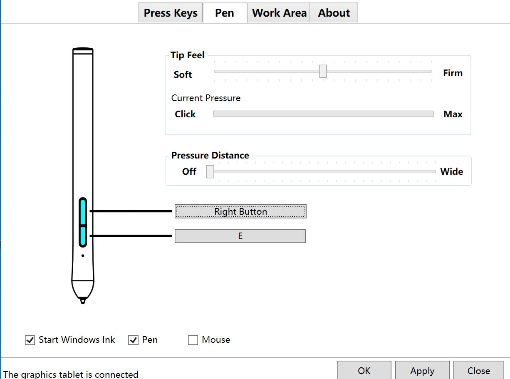
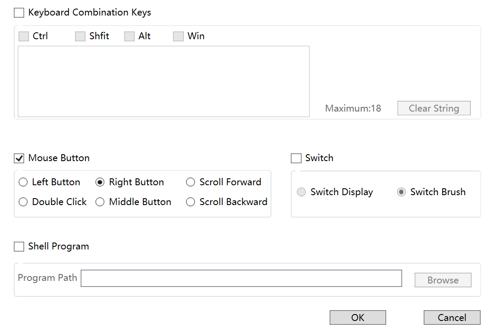
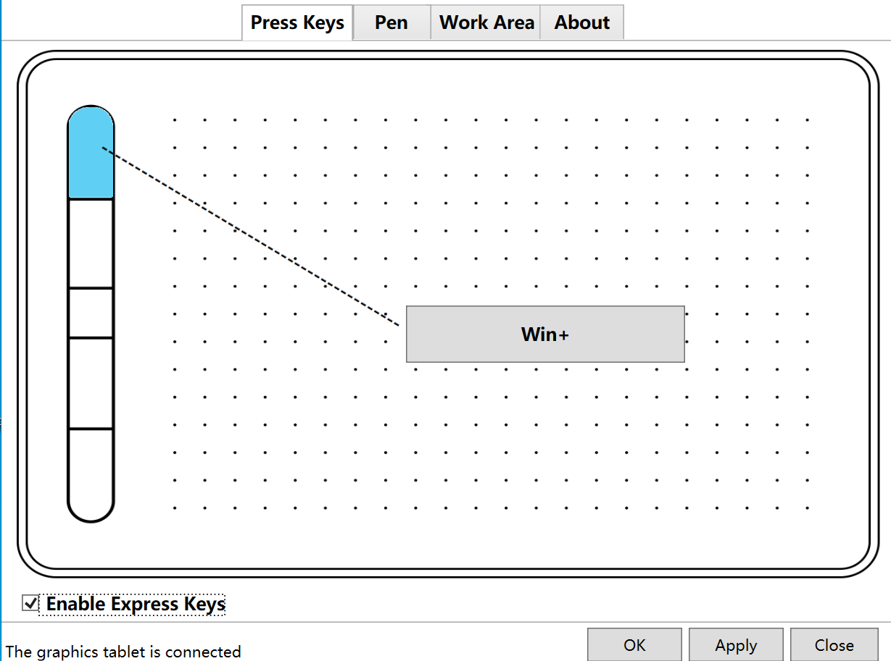
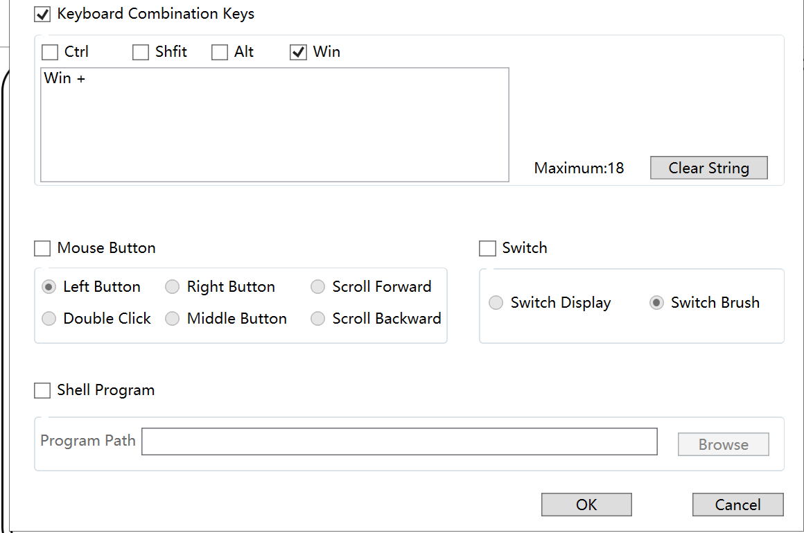

We save more research and development costs for digital panel manufacturers, expanding our own market competitiveness. Our digital panel drivers work better than other manufacturers with strong compatibility, and we use completely independent research and development technology with source code. We don't use wacom proprietary technology. At present, several manufacturers in China are using our driving technology, and the sales volume and reputation are very good.
* **Drive authorization, customized development, please contact : [531401335@qq.com **](mailto:531401335@qq.com**)
* **WeChat : xinhuitech **

### characteristics
* Support MacOS 10.8 system or above
* Support windows7 or above (32-bit, 64-bit)
* Supports 8192 levels of pressure, as well as dynamically adjusted pressure
* Support multi-screen operation
* Support screen real - time display
* Digital panel keyboard shortcut settings, screen switch, brush switch and other functions
* Support screen rotation, artboard rotation, digital board and screen mapping area free switch
* Windows supports wintab32, windows lnk modes
* All windows and mac graphics software supports pressure sensing
* Driven interface and usage of MAC and Windows versions are almost the same, without any difference.

### painting test
* Quick painting

* Slow painting

### Introduction to Source Code
#### windows
##### Source code contains 3 modules, with low coupling
* The gui is primarily used for user interface
* TabletDriverSerivce is primarily used to process logical business data of digital board.

* All graphics software of Wintab calls the interface of Wintab, otherwise the it will be in no pressure state, which means it cannot be used normally. We have redeveloped the relevant interface of Wintab, which can be well used with Windows LNK mode, and perfectly compatible with the graphics software in the market on Win10 and Win7 systems.
#### MacOS
* Support 10.8 systems or above. The whole driver module simulates the pressure sense of the tablet, which is perfectly compatible with all the drawing software in the market.
### The following software has been tested without any problems
#### List of Windows tests
* Adobe Photoshop
* CorelDRAW
* Corel PHOTO-PAINT
* openCanvas
* MediBang Paint Pro
* PaintToolSai
* SketchBook
* windows lnk(win10)

#### List of macOS tests
* Artrage_5.0.4
* Photoshop_2019
* SketchBook Pro 2020
* Corel_Painter_2018
* Adobe_Animate_2019
* Photoshop CS6
### The interface shows Windows above and MacOS below
* Support multi-screen extension, screen area free selection and other scaling, and customize area settings
* Support digital board rotation, region mapping
* Support pen pressing soft and hard settings, digital pen button settings
* Support a variety of digital pen mode, Windows lnk, pen mode, mouse mode
* Support keyboard shortcuts, one key to bind multiple function keys, and display key status
* Special key settings
##### Work area display
* Screen identification, drag-able mapping area, digital board rotation, etc

###### Digital pen setting display
* Support pen tip induction settings and pen pressure settings.
* Keyboard settings, special keyboard settings. switch screen. switch brush and other functions of the digital panel
* Multiple drawing modes

##### Shortcut interface display
* Support shortcut key real-time display
* Multiple key combination settings
* Special shortcut key settings. screen switch. brush switch and other functions

